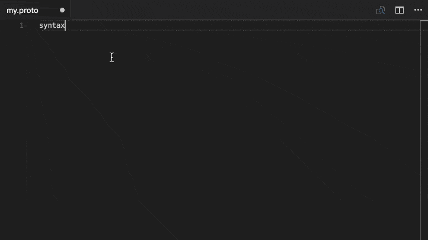

# vscode-proto3


Protobuf 3 support for Visual Studio Code

https://github.com/zxh0/vscode-proto3

### VSCode Commands

_By default **ctrl-shift-p** opens the command prompt._

| Command | Description |
|---------|-------------|
| `proto3: Compile All Protos` | Compiles all workspace protos using [configurations](#extension-settings) defined with `protoc.options`. |
| `proto3: Compile This Proto` | Compiles the active proto using [configurations](#extension-settings) defined with `protoc.options`. |


## Features

- syntax highlighting.
- syntax validation.
- code snippets.
- code completion.
- code formatting.
- brace matching.
- line and block commenting.
- compilation.



### Syntax Highlighting

The grammar is written in tmLanguage JSON format.

### Syntax Validation

The validation is triggered when you save the proto file. You need protoc 
compiler to enable syntax validation. You also need a settings.json file 
to tell the extension the full path of protoc if it is not in `path`. 

### Extension Settings

Below is an example settings.json file which comes from 
[example/.vscode](https://github.com/zxh0/vscode-proto3/tree/master/example/.vscode):
```json
{
    "protoc": {
        "path": "/path/to/protoc",
        "compile_on_save": false,
        "options": [
            "--proto_path=protos/v3",
            "--proto_path=protos/v2",
            "--proto_path=${workspaceRoot}/proto",
            "--proto_path=${env.GOPATH}/src",
            "--java_out=gen/java"
        ]
    }
}
```

#### Fields

The possible fields under the `protoc` extension settings which can be defined in a `settings.json` file.

| Field           | Type     | Default          | Description                                                                    |
| --------------- | -------- | ---------------- | ------------------------------------------------------------------------------ |
| path            | string   | _protoc in PATH_ | Path to protoc. Defaults to protoc in PATH if omitted.                         |
| compile_on_save | boolean  | false            | On `.proto` file save, compiles to `--*_out` location within `options`         |
| options         | string[] | []               | protoc compiler arguments/flags, required for proto validation and compilation |


#### In-Line Variables

These variables can be used to inject variables strings within the `protoc` extension configurations. See above for examples.

| Variable      | Description                              |
| ------------- | ---------------------------------------- |
| config.*      | Refer settings items in ``Preferences``. |
| env.*         | Refer environment variable.              |
| workspaceRoot | Returns current workspace root path.     |

### Code Completion

A very simple parser is written to support code completion. 

### Code Snippets

| prefix | body                                           |
| ------ | ---------------------------------------------- |
| sp2    | `syntax = "proto2";`                           |
| sp3    | `syntax = "proto3";`                           |
| pkg    | `package package.name;`                        |
| imp    | `import "path/to/other/protos.proto";`         |
| ojp    | `option java_package = "java.package.name";`   |
| ojoc   | `option java_outer_classname = "ClassName";`   |
| o4s    | `option optimize_for = SPEED;`                 |
| o4cs   | `option optimize_for = CODE_SIZE;`             |
| o4lr   | `option optimize_for = LITE_RUNTIME;`          |
| odep   | `option deprecated = true;`                    |
| oaa    | `option allow_alias = true;`                   |
| msg    | `message MessageName {}`                       |
| fbo    | `bool field_name = tag;`                       |
| fi32   | `int32 field_name = tag;`                      |
| fi64   | `int64 field_name = tag;`                      |
| fu32   | `uint32 field_name = tag;`                     |
| fu64   | `uint64 field_name = tag;`                     |
| fs32   | `sint32 field_name = tag;`                     |
| fs64   | `sint64 field_name = tag;`                     |
| ff32   | `fixed32 field_name = tag;`                    |
| ff64   | `fixed64 field_name = tag;`                    |
| fsf32  | `sfixed32 field_name = tag;`                   |
| fsf64  | `sfixed64 field_name = tag;`                   |
| ffl    | `float field_name = tag;`                      |
| fdo    | `double field_name = tag;`                     |
| fst    | `string field_name = tag;`                     |
| fby    | `bytes field_name = tag;`                      |
| fm     | `map<key, val> field_name = tag;`              |
| foo    | `oneof name {}`                                |
| en     | `enum EnumName {}`                             |
| sv     | `service ServiceName {}`                       |
| rpc    | `rpc MethodName (Request) returns (Response);` |

### Google API Design Guide

The following snippets are based on
[Google API Design Guide](https://cloud.google.com/apis/design/).

| prefix | reference                                                                 |
| ------ | ------------------------------------------------------------------------- |
| svgapi | [Standard Methods](https://cloud.google.com/apis/design/standard_methods) |

## Code Formatting

Support "Format Document" if `clang-format` is in path, including custom `style` options.

By default, `clang-format`'s standard coding style will be used for formatting. To define a custom style or use a supported preset add `"clang-format.style"` in VSCode Settings (`settings.json`)

### Example usage:
`"clang-format.style": "google"`

This is the equivalent of executing `clang-format -style=google` from the shell.

For further formatting options refer to the [official `clang-format` documentation](https://clang.llvm.org/docs/ClangFormatStyleOptions.html)

## Known Issues

Auto-completion not works in some situations.

## Release Notes

See [CHANGELOG.md](CHANGELOG.md).
